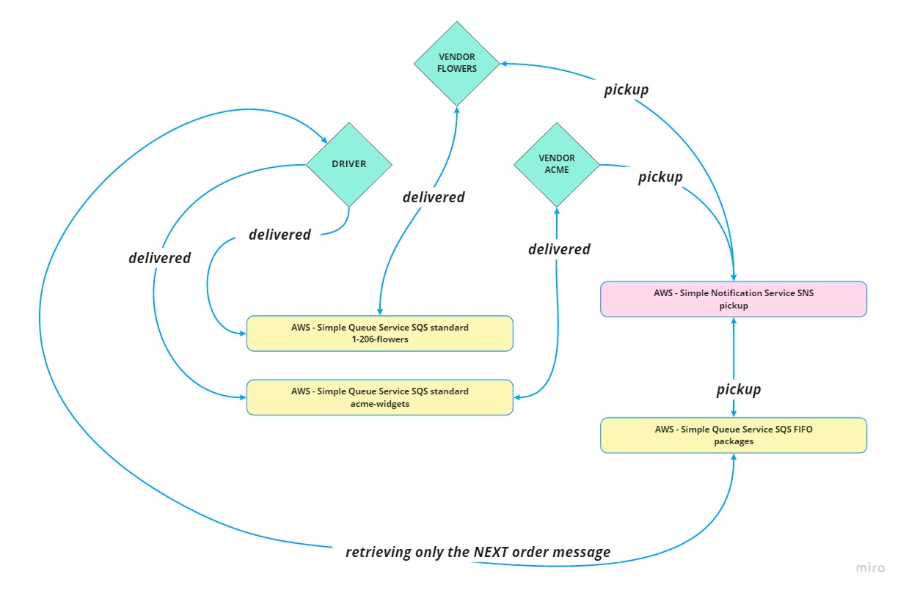
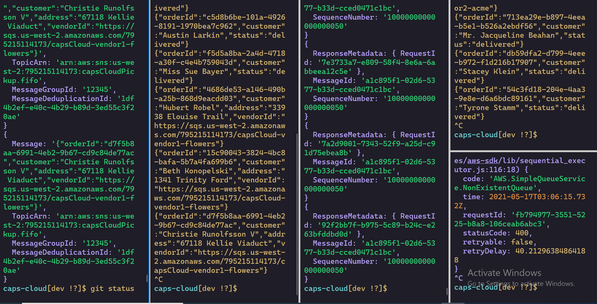

# LAB - Class 19

## Project: caps-cloud

codefellows delivery system transfered to the cloud

## Author: Fizzo Pannosch

## Links and Resources

- [github pullrequest for caps-cloud](https://github.com/fizzo999/caps-cloud/pull/1)

## Setup

### How to initialize/run your application

- Clone the repository
- `cd caps-cloud`
- `npm install` (to install the dependencies that are listed in the package.json)
- open 5 terminal windows (all here in caps-cloud) and run command:
- `npm run s1` (will start vendor-flowers/vendor-sns-pickup.js - which is the order generator)
- `npm run s2` (will start vendor-flowers/vendor-sqs-delivered.js - which is the listener for delivered)
- `npm run s3` (will start vendor-acme/vendor-sns-pickup.js - which is the order generator)
- `npm run s4` (will start vendor-acme/vendor-sqs-delivered.js - which is the listener for delivered)
- `npm run s5` (will start driver/driver.js - which is the driver app)

### UML / Application Wiring Diagram

#### 
  

### screenshot of 5 terminals with: 1.) sns pickup 2.) sqs delivered 3.) sns pickup 4.) sqs delivered 5.) driver

#### 
  

